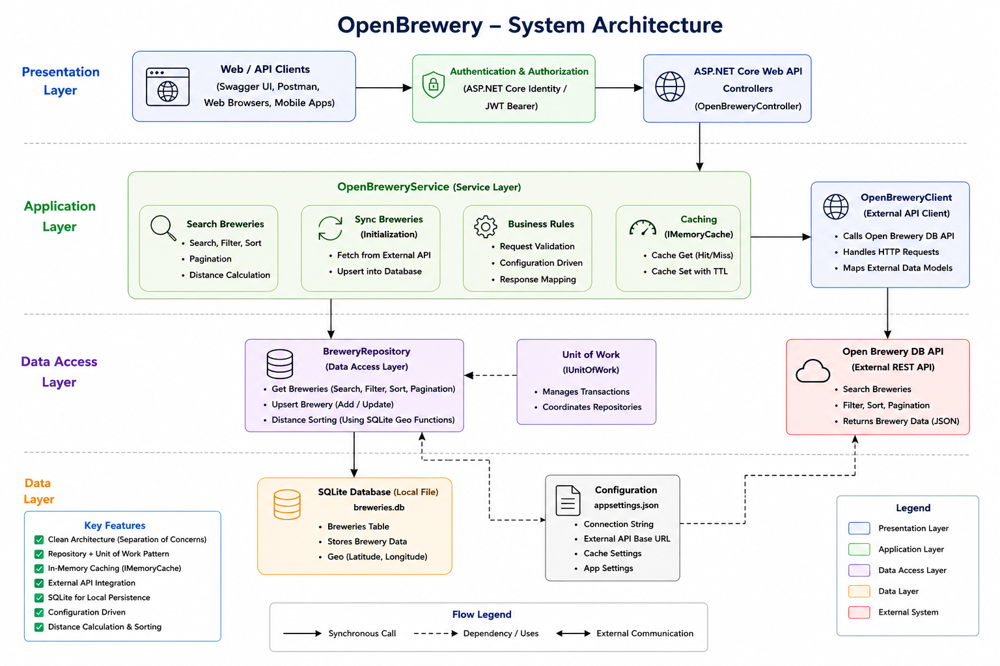
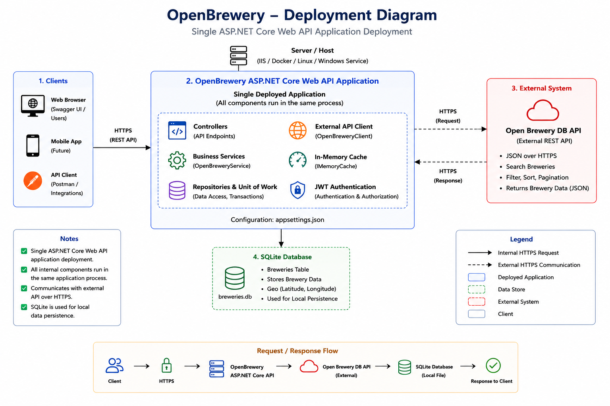
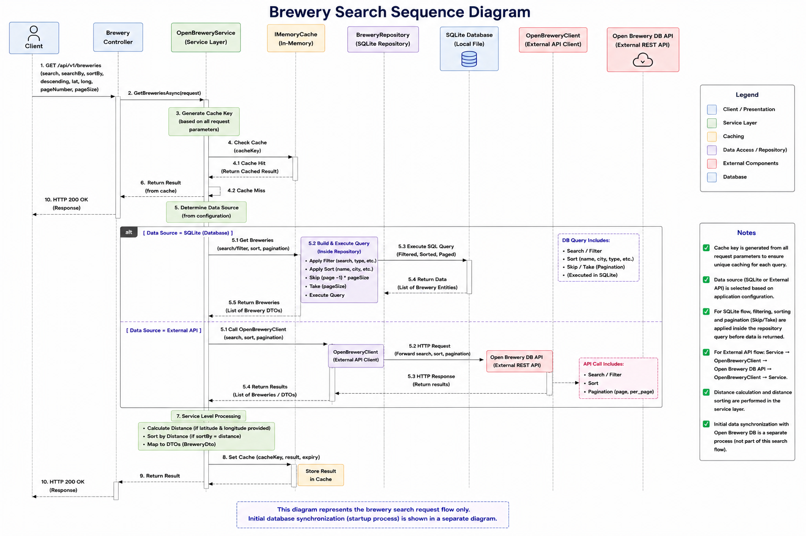

# Open Brewery API

A .NET 8 RESTful Web API that integrates with the Open Brewery DB API to search, sort, paginate, and retrieve brewery information.

The application supports both an external API data source and a local SQLite database using Entity Framework Core. It also includes caching, API versioning, JWT authentication, centralized error handling, logging, and resumable database synchronization.

## Features

- .NET 8 / ASP.NET Core Web API
- Open Brewery DB API integration
- SQLite database with Entity Framework Core
- Configurable data source:
  - External Open Brewery DB API
  - Local SQLite database
- Pagination
- Search by brewery name or city
- Autocomplete search
- Sorting by:
  - Brewery name
  - City
  - Distance
- Ascending and descending sorting
- Distance calculation using latitude and longitude
- 10-minute configurable in-memory caching
- API versioning
- JWT authentication and authorization
- Swagger / OpenAPI documentation
- Centralized error handling
- Structured logging
- Database initialization and migration
- Resumable page-based database synchronization
- Unit tests using xUnit and Moq
- Repository and Unit of Work patterns
- Dependency Injection and SOLID principles

## Architecture

The application follows a layered architecture with clear separation of concerns.

- **API Layer** handles HTTP requests, authentication, authorization, API versioning, and responses.
- **Core Layer** contains domain entities, models, interfaces, enums, DTOs, utilities, and configuration contracts.
- **Infrastructure Layer** contains external API clients, EF Core persistence, repositories, and application services.
- **Application Services** coordinate business operations such as searching, sorting, pagination, caching, and data source selection.
- **Database Synchronization Service** handles initial data population and resumable synchronization from the external API to SQLite.

The application uses dependency injection and abstractions to keep business logic independent of infrastructure implementations.

## System Architecture



## Deployment Diagram



## Brewery Search Sequence



## Solution Structure

```text
OpenBrewery
│
├── OpenBrewery.Api
│   ├── Controllers
│   └── Program.cs
│
├── OpenBrewery.Core
│   ├── Entities
│   ├── Models
│   ├── Interfaces
│   ├── Enums
│   ├── DTOs
│   ├── Utilities
│   └── Configuration
│
├── OpenBrewery.Infrastructure
│   ├── External
│   │   ├── Clients
│   │   └── Models
│   │
│   ├── Persistence
│   │   ├── Context
│   │   ├── Repositories
│   │   └── Migrations
│   │
│   └── Services
│
└── OpenBrewery.Tests
    ├── Integration
    └── Unit
```

## Data Sources

The application supports two configurable data sources.

### External API

The application can retrieve brewery data directly from the Open Brewery DB API.

The external API client is responsible for:

- Building API requests
- Sending HTTP requests
- Deserializing responses
- Handling unsuccessful HTTP responses
- Logging external API failures

### SQLite Database

The application can retrieve brewery data from a local SQLite database using Entity Framework Core.

The repository layer is responsible for database access, including:

- Filtering
- Sorting
- Pagination
- Data retrieval
- Data persistence

The data source can be configured through application configuration.

## Search, Sorting and Pagination

The API supports searching breweries by:

- Name
- City

Autocomplete functionality is also available for brewery name searches.

The API supports sorting by:

- Name
- City
- Distance

Sorting can be performed in:

- Ascending order
- Descending order

Pagination is supported using page number and page size parameters.

Where the SQLite database is used, filtering, sorting, and pagination are performed at the database query level where possible to avoid loading unnecessary records into application memory.

## Caching

The application uses in-memory caching to reduce repeated calls to the external data source.

The cache expiration is configurable and defaults to 10 minutes.

This helps:

- Reduce unnecessary external API calls
- Improve response performance
- Minimize dependency on the external API

## Database Initialization and Synchronization

When the application starts, the database is migrated automatically and the initialization status is checked.

The database synchronization process retrieves brewery data from the external API in pages and stores it in SQLite.

The synchronization process:

1. Checks the current initialization status.
2. Determines the last successfully processed page.
3. Resumes from the next page if a previous synchronization failed.
4. Retrieves brewery data in batches.
5. Maps external API models to application entities.
6. Persists the data to SQLite.
7. Updates synchronization progress after successful processing.
8. Uses transactions for each page.
9. Rolls back the current page transaction if processing fails.
10. Marks initialization as completed after all pages are processed.

This approach avoids restarting the entire synchronization process after a failure.

## API Endpoints

The API is versioned and can be accessed using the following examples.

### Get Breweries

```http
GET /api/v1/breweries?pageNumber=1&pageSize=20
```

### Search by Brewery Name

```http
GET /api/v1/breweries?search=brew&searchBy=name
```

### Search by City

```http
GET /api/v1/breweries?search=san%20diego&searchBy=city
```

### Sort by Name

```http
GET /api/v1/breweries?sortBy=name&descending=false
```

### Sort by City

```http
GET /api/v1/breweries?sortBy=city&descending=false
```

### Sort by Distance

```http
GET /api/v1/breweries?sortBy=distance&userLatitude=19.9975&userLongitude=73.7898
```

### Autocomplete Search

```http
GET /api/v1/breweries/search?query=brew
```

## Authentication

The API uses JWT Bearer authentication and authorization.

Protected endpoints require a valid JWT access token with the Reader role.

### Getting an Access Token

For local development and testing, an access token can be generated using the internal token endpoint.

```http
POST /api/auth/token
```

The endpoint does not require a request body or user credentials.

Example:

```bash
curl -X POST https://localhost:<port>/api/auth/token
```

The endpoint generates and returns a JWT access token using the configured JWT settings.

Example response:

```text
<jwt-access-token>
```

### Calling Protected Endpoints

Use the returned token in the `Authorization` header when calling protected API endpoints:

```http
Authorization: Bearer <jwt-access-token>
```

Example:

```bash
curl -X GET "https://localhost:<port>/api/v1/breweries" \
  -H "Authorization: Bearer <jwt-access-token>"
```

### Authentication Flow

```text
Client
   │
   │ POST /api/auth/token
   ▼
AuthController
   │
   │ Generate JWT
   │ - Issuer
   │ - Audience
   │ - Expiration
   │ - Claims
   ▼
JWT Access Token
   │
   │ Return Token
   ▼
Client
   │
   │ Authorization: Bearer <token>
   ▼
Protected API Endpoint
   │
   ▼
JWT Authentication Middleware
   │
   ├── Invalid / Missing Token ──► 401 Unauthorized
   │
   └── Valid Token
           │
           ▼
      API Controller
           │
           ▼
      API Response
```

The generated token currently contains predefined claims for a test user and the `Reader` role.

JWT configuration, including the signing key, issuer, audience, and expiration, is provided through application configuration.

> **Security Note:** The token endpoint is intended for local development and testing. In a production environment, token issuance should typically be delegated to a proper identity provider, and sensitive signing keys should be stored securely using environment variables, a secret store, or a managed identity platform.

## Running the Application

### Prerequisites

- .NET 8 SDK
- Visual Studio 2022 or Visual Studio Code

### Clone the Repository

```bash
git clone https://github.com/meet2ngk/OpenBreweryChallenge.git
cd OpenBreweryChallenge
```

### Restore Dependencies

```bash
dotnet restore
```

### Build the Solution

```bash
dotnet build
```

### Run the API

```bash
dotnet run --project OpenBrewery.Api
```

## Database Setup

The application uses SQLite with Entity Framework Core.

During application startup:

1. EF Core applies pending database migrations.
2. The initialization status is checked.
3. If synchronization has not completed, the database synchronization process can resume from the last successfully processed page.
4. Once all available brewery data has been processed, initialization is marked as completed.

This allows the application to maintain a local copy of brewery data while supporting resumable synchronization.

The SQLite database file is persisted locally and is not recreated every time the application starts.

## Running Tests

Run all tests using:

```bash
dotnet test
```

The test suite uses:

- xUnit
- Moq

Tests cover scenarios including:

- External API success and failure
- Empty API responses
- Brewery search
- Search by name
- Search by city
- Sorting
- Repository queries
- Empty database scenarios
- Data persistence
- Database synchronization behavior

## API Documentation

During local development, Swagger / OpenAPI documentation is available when the application is running in the `Development` environment.

Start the application using:

```bash
dotnet run --project OpenBrewery.Api
```

Open Swagger UI using:

```text
https://localhost:<port>/swagger
```

Swagger UI provides an interactive way to explore and test the available API endpoints.

API versioning is supported through versioned API routes.

> **Note:** Swagger UI is intended for local development and testing and should not be publicly exposed in production unless it is appropriately secured.

## Technologies

- C#
- .NET 8
- ASP.NET Core Web API
- Entity Framework Core
- SQLite
- Open Brewery DB API
- Swagger / OpenAPI
- JWT Authentication
- In-Memory Caching
- xUnit
- Moq
